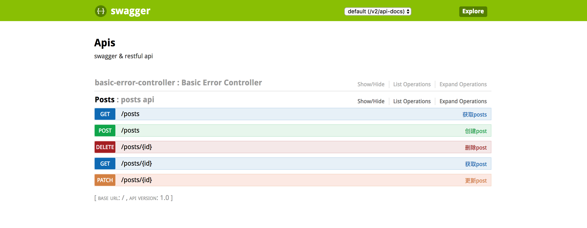

Swagger Demo
=====

> swagger & restful api

## Install
    # in Mac OS
    $ brew install gradle
    
## Run
    $ gradle bootRun
    
    $ open http://localhost:8080/swagger-ui.html 
    
## ScreenShot

## 打赏

> 如果觉得我的代码对你有帮助 ↓↓↓ 😬

